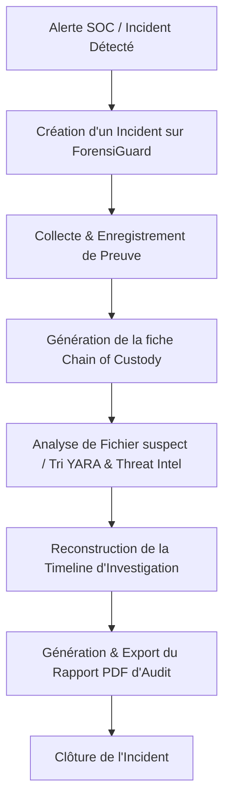

# ForensiGuard — Spécification de Design Produit (Phase 1)

Ce document définit la vision stratégique, les personas, la proposition de valeur et la feuille de route fonctionnelle de ForensiGuard.

---

## 1. Vision du Produit
ForensiGuard est une plateforme SaaS de **Digital Forensics and Incident Response (DFIR)** collaborative et automatisée. Elle permet aux équipes de sécurité (SOC, CERT, CSIRT) de collecter des preuves numériques de manière intègre, d'analyser les fichiers suspects via des règles YARA et de la Threat Intelligence, de reconstruire automatiquement des lignes de temps (timelines) d'attaques, et de générer des rapports d'audit prêts pour la justice ou l'assurance.

## 2. Proposition de Valeur
* **Réduction drastique du MTTR (Mean Time to Resolution)** : Centralise l'analyse des artéfacts et automatise le triage initial.
* **Intégrité et Rigueur Légale** : Suivi strict de la Chaîne de Possession (Chain of Custody) avec empreintes cryptographiques et horodatages immuables.
* **Collaboration en Temps Réel** : Permet aux analystes de travailler simultanément sur la même investigation sans écraser les données des autres.
* **Rapports Prêts à l'Emploi** : Export en un clic de rapports PDF complets pour la direction ou les autorités compétentes.

## 3. Personas

### Persona A : Alex, Analyste SOC (L1/L2)
* **Objectif** : Valider rapidement si un fichier suspect ou une alerte est un faux positif ou une véritable menace.
* **Points de frustration** : Trop d'outils différents en ligne de commande, perte de temps à calculer les hashes et à les soumettre manuellement sur VirusTotal, manque d'historisation.
* **Usage de ForensiGuard** : Upload de fichiers suspects, lecture immédiate du score de menace et des signatures YARA correspondantes.

### Persona B : Sarah, Analyste DFIR (L3 / Incident Responder)
* **Objectif** : Reconstruire le scénario d'une attaque complexe, préserver les preuves sur une machine compromise et préparer un dossier d'investigation.
* **Points de frustration** : Gestion manuelle des fiches de chaîne de possession sur Excel, fusion laborieuse de journaux d'événements disparates en une timeline chronologique cohérente.
* **Usage de ForensiGuard** : Importation de fichiers journaux, gestion de la chaîne de possession des disques/RAM reçus, création et édition de la Timeline d'investigation globale.

### Persona C : Marcus, Responsable SOC & Compliance (CISO)
* **Objectif** : Superviser l'activité globale du SOC, valider la conformité des processus d'investigation et valider les rapports finaux.
* **Points de frustration** : Difficulté à suivre qui a fait quoi sur une preuve (problème d'audit), rapports techniques illisibles pour la direction générale.
* **Usage de ForensiGuard** : Tableau de bord de supervision, journal d'audit complet (qui a consulté/modifié quoi), téléchargement de rapports PDF résumés.

---

## 4. Parcours Utilisateur (User Journeys)

---

## 5. Fonctionnalités

### MVP (Minimum Viable Product)
* **Gestion des Incidents** : Tableau de bord centralisé pour suivre le statut, la sévérité et l'assignation des incidents.
* **Collecte et Chaîne de Possession** : Formulaire d'enregistrement des pièces à conviction avec calcul de hash à la volée (MD5, SHA-1, SHA-256) et journal d'audit immuable.
* **Analyse de Fichiers Statique** : Upload de fichiers suspects, analyse automatique avec règles YARA, métadonnées de base et vérification d'indicateurs (IOC).
* **Timeline Chronologique** : Ajout manuel et semi-automatisé d'événements clés dans une timeline visuelle interactive avec filtres par tag et catégorie.
* **Threat Intelligence Mockée** : Corrélation des hashes avec une base de réputation locale et enrichissement automatique.
* **Rapport PDF** : Génération d'un PDF d'analyse et de chaîne de possession signé avec l'identité de l'analyste.
* **RBAC de base** : Rôles *Admin* (tous droits), *Analyst* (création/modification), *Viewer* (lecture seule).

### V2 (Évolutions Futures)
* **Analyse Dynamique (Sandbox)** : Soumission de fichiers vers une sandbox isolée pour capturer le comportement réseau, les processus enfants et les clés de registre modifiées.
* **Agent ForensiGuard Direct** : Déploiement d'un agent léger (PowerShell/Go) sur un poste distant pour extraire la RAM ou les fichiers clés ($MFT, EVTX) directement dans le SaaS.
* **Analyse IA Assistée** : Modèle de langage local/API sécurisé pour résumer les conclusions d'analyse et proposer des recommandations d'atténuation.
* **Intégrations SIEM & SOAR** : Connecteurs natifs avec Splunk, Microsoft Sentinel et Jira.

---

## 6. Feuille de Route Produit (Roadmap)
* **Mois 1** : Design System, Maquettes UX/UI, Initialisation de la plateforme (React / FastAPI / PostgreSQL) - *En cours*
* **Mois 2** : Module d'analyse de fichiers (YARA + Hashes) et Gestion de la Chaîne de Possession.
* **Mois 3** : Module Timeline interactive, Dashboard consolidé et moteur de rapports PDF.
* **Mois 4** : Implémentation du RBAC avancé, du MFA (TOTP), tests d'intrusion, audit de performance et lancement commercial MVP.
